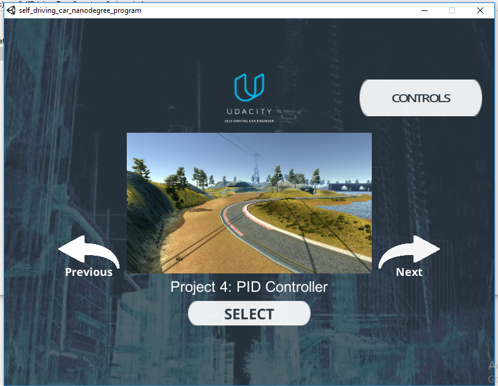

# CarND-Controls-PID
Self-Driving Car Engineer Nanodegree Program

---

## Dependencies

* cmake >= 3.5
 * All OSes: [click here for installation instructions](https://cmake.org/install/)
* make >= 4.1(mac, linux), 3.81(Windows)
  * Linux: make is installed by default on most Linux distros
  * Mac: [install Xcode command line tools to get make](https://developer.apple.com/xcode/features/)
  * Windows: [Click here for installation instructions](http://gnuwin32.sourceforge.net/packages/make.htm)
* gcc/g++ >= 5.4
  * Linux: gcc / g++ is installed by default on most Linux distros
  * Mac: same deal as make - [install Xcode command line tools]((https://developer.apple.com/xcode/features/)
  * Windows: recommend using [MinGW](http://www.mingw.org/)
* [uWebSockets](https://github.com/uWebSockets/uWebSockets)
  * Run either `./install-mac.sh` or `./install-ubuntu.sh`.
  * If you install from source, checkout to commit `e94b6e1`, i.e.
    ```
    git clone https://github.com/uWebSockets/uWebSockets 
    cd uWebSockets
    git checkout e94b6e1
    ```
    Some function signatures have changed in v0.14.x. See [this PR](https://github.com/udacity/CarND-MPC-Project/pull/3) for more details.
* Simulator. You can download these from the [project intro page](https://github.com/udacity/self-driving-car-sim/releases) in the classroom.

There's an experimental patch for windows in this [PR](https://github.com/udacity/CarND-PID-Control-Project/pull/3)

## Basic Build Instructions

1. Clone this repo.
2. Make a build directory: `mkdir build && cd build`
3. Compile: `cmake .. && make`
4. Run it: `./pid`. 

Tips for setting up your environment can be found [here](https://classroom.udacity.com/nanodegrees/nd013/parts/40f38239-66b6-46ec-ae68-03afd8a601c8/modules/0949fca6-b379-42af-a919-ee50aa304e6a/lessons/f758c44c-5e40-4e01-93b5-1a82aa4e044f/concepts/23d376c7-0195-4276-bdf0-e02f1f3c665d)

The project could be executed directly using `./build/pid` or if there are some modification and a build is needed you can use the script `./makeAndrun.sh`:

```
> ./makeAndrun.sh
[100%] Built target pid
Listening to port 4567
```

Now the PID controller is running and listening on port 4567 for messages from the simulator. Next step is to open Udacity's simulator:

Using the right arrow, you need to go to the Project 4: PID Controller project:



Click the "Select" button, and the car starts driving. You will see the debugging information on the PID controller terminal. A short video with the final config is [./videos/final-config.mov](./videos/final-config.mov).

# [Rubric](https://review.udacity.com/#!/rubrics/824/view) points

## Compilation

### Your code should compile.

The code compiles without errors or warnings. No modifications were done on the provided setup.

## Implementation

### The PID procedure follows what was taught in the lessons.

The PID implementation is done on the [./src/PID.cpp](./src/PID.cpp). The [PID::UpdateError](./src/PID.cpp#L33) method calculates proportional, integral and derivative errors and the [PID::TotalError](./src/PID.cpp#L55) calculates the total error using the appropriate coefficients.

## Reflection

### Describe the effect each of the P, I, D components had in your implementation.

- The proportional portion of the controller tries to steer the car toward the center line (against the cross-track error). If used along, the car overshoots the central line very easily and go out of the road very quickly. 

- The integral portion tries to eliminate a possible bias on the controlled system that could prevent the error to be eliminated. If used along, it makes the car to go in circles. In the case of the simulator, no bias is present. 

- The differential portion helps to counteract the proportional trend to overshoot the center line by smoothing the approach to it. 

### Describe how the final hyperparameters were chosen.

The parameters were chosen manually by trial and error method. First, make sure the car can drive straight with zero as parameters. Then add the proportional and the car start going on following the track but it starts to overshoot and go out of the track. Then add the differential to try to overcome the overshooting on the track. The integral part only moved the car out of the road; so, it stayed as zero. After the car drove the track without going out of it, the parameters increased to minimize the average cross-track error on a single track lap. The final parameters where [P: 1.5, I: 0.0, D: 2.5].

## Simulation

### The vehicle must successfully drive a lap around the track.

A short video with the final parameters is [./vedio/final-config.mov](./final-config.mov).


